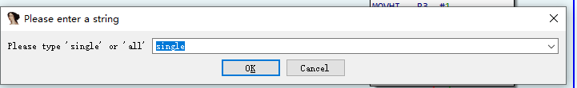
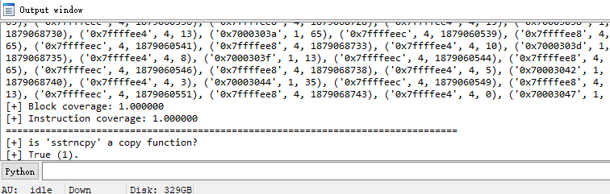

# CPSeeker
A prototype of Memory-like function seeker (CPSeeker), a hybrid (static analysis and dynamic analysis) analysis method that identifies the memory copy function in the (stripped) binary executables.


# Research paper

We present our approach and findings of this work in the following research paper: <br>
<strong> Memcpy-Like Function Identification Method with Static and Dynamic Hybrid Analysis </strong> (reviewing)

# Directories

```shell
|-- code    # the prototype of CPSeeker and baseline methods
    |-- CPSeeker # the prototype of CPSeeker
    |-- baseline # baseline methods
        |-- BootStomp_finder.py
        |-- Karonte_finder.py
        |-- SaTC_finder.py
        |-- SaTC_finder_fix.py
        |-- helper.py
        |-- opcodes.py

|-- dataset # dataset used in the evaluation
    |-- clang # binary executables compiled by clang
    |-- gcc   # binary executables compiled by gcc
        |-- C  # memcpy-like functions in the C libarary
        |-- user-defined  # user defined memcpy-like functions
    |-- CVE # cves used in the evaluation
        |-- CVE-2017-13772
        |-- CVE-2017-6548
        |-- CVE-2018-11013
        |-- CVE-2018-3950
        |-- CVE-2018-3951
        |-- CVE-2020-8423
    |-- Firmware
        |-- c2900-universalk9-mz.SPA.157-3.M2.bin
```
# Running environment

Te run code in this repository, you need the IDA Pro (version 7.5) with Python3 support, [Unicorn (1.0.2rc4)](https://github.com/unicorn-engine/unicorn), [pyvex](https://github.com/angr/pyvex), networkx.


# Running example
CPSeeker provides two modes of operation, analysis of a single function and analysis of the entire binary program. The single function analysis is as follows:<br>

<br>
The output result is:<br>



# Future work

We will update it to support PowerPC. Unicorn did not support the PowerPC architecture when we implemented CPSeeker, but now it does. Subsequently, we will upgrade the Unicorn version.
